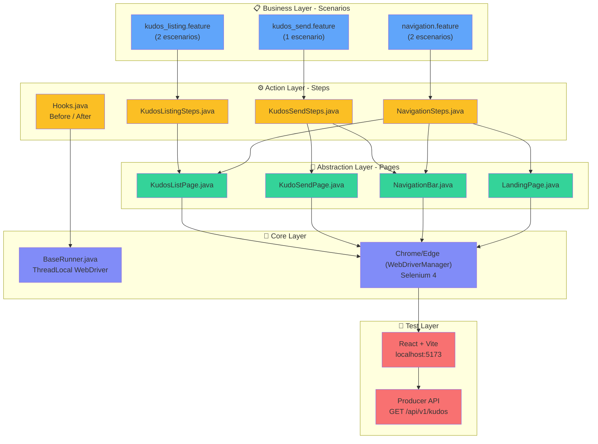

# 🧪 POM Page Factory — Sofkianos MVP E2E Automation

Framework de automatización E2E para el frontend de **Sofkianos MVP** usando **Page Object Model (POM)** con **Page Factory**, **Cucumber** y **JUnit 5**.

> 🔗 **Aplicación bajo prueba:** Este framework automatiza el frontend del proyecto [**Sofkianos MVP**](https://github.com/ElyRiven/sofkianos-mvp), un sistema distribuido de reconocimientos (Kudos) entre compañeros construido con React + Vite (frontend) y Spring Boot (backend).

---

## 📋 Tabla de Contenido

- [Arquitectura E2E](#arquitectura-e2e)
- [Historias de Usuario Cubiertas](#historias-de-usuario-cubiertas)
- [Estructura del Proyecto](#estructura-del-proyecto)
- [Instrucciones de Ejecución](#instrucciones-de-ejecución)
- [Reportes](#reportes)
- [Patrones de Diseño](#patrones-de-diseño)
- [Buenas Prácticas](#buenas-prácticas)


---

## Arquitectura E2E

Arquitectura consolidada desde los escenarios Gherkin hasta la aplicación bajo prueba:



---

## Historias de Usuario Cubiertas

### Escenarios Totales: 5 ejecutables (2 + 1 + 2)

| Feature | Escenarios | Page Objects | Steps |
|---|---|---|---|
| `kudos_listing.feature` | 2 | KudosListPage | KudosListingSteps |
| `kudos_send.feature` | 1 | KudoSendPage | KudosSendSteps |
| `navigation.feature` | 2 | NavigationBar, LandingPage | NavigationSteps |

### US-012 — Listado público de Kudos con filtros y paginación

```gherkin
Scenario: El usuario cambia el orden de los kudos por fecha
  Given el usuario se encuentra en la página de exploración de kudos
  When cambia la dirección de ordenamiento
  Then el indicador de orden refleja la nueva dirección

Scenario: El botón de página anterior se deshabilita en la primera página
  Given el usuario se encuentra en la primera página de resultados
  Then el botón de página anterior está deshabilitado
```

### Envío de Kudos

```gherkin
Scenario: El usuario accede al formulario de envío de kudos
  Given el usuario está en la página de envío de kudos
  When completa el formulario
  Then envía el kudos exitosamente
```

### Navegación (cross-cutting)

```gherkin
Scenario: El usuario navega desde la landing hacia la exploración de kudos
  Given el usuario está en la landing
  When hace clic en el botón de exploración
  Then llega a la página de listado

Scenario: El usuario navega desde la landing hacia el envío de kudos
  Given el usuario está en la landing
  When hace clic en el botón de envío
  Then llega al formulario de envío
```

---

## Estructura del Proyecto

```
sofkianos-mvp/pom-pagefactory/
├── 📄 build.gradle                                 ← Gradle config + dependencies
├── 📄 settings.gradle                              ← Gradle settings
├── 📄 README.md                                    ← Este archivo
├── 📁 gradle/                                      
│   └── wrapper/                                    ← Gradle Wrapper (no requiere Gradle instalado globalmente)
│       ├── gradle-wrapper.jar
│       └── gradle-wrapper.properties
├── 📁 src/
│   ├── main/java/com/sofka/automation/
│   │   └── pages/                                  ← Page Objects (POM Pattern con @FindBy)
│   │       ├── KudosListPage.java                  ← Elementos para kudos_listing.feature
│   │       ├── KudoSendPage.java                   ← Elementos para kudos_send.feature
│   │       ├── LandingPage.java                    ← Elementos para landing (home)
│   │       └── NavigationBar.java                  ← Elemento navbar (cross-feature)
│   │
│   └── test/java/com/sofka/automation/
│       ├── runners/                                ← Test Executors (JUnit + Cucumber)
│       │   ├── BaseRunner.java                     ← WebDriver factory con ThreadLocal
│       │   │                                          (WebDriverManager + try-catch fallback)
│       │   ├── RunKudosListingTest.java            ← @RunWith(CucumberWithSerenity)
│       │   │                                          @SuppressWarnings({"deprecation", "removal"})
│       │   │                                          @CucumberOptions(features="...");
│       │   ├── RunKudosSendTest.java               ← Idem para send
│       │   └── RunNavigationTest.java              ← Idem para navigation
│       │
│       └── stepdefinitions/                        ← Step Implementations
│           ├── Hooks.java                          ← @Before (init driver) / @After (quit driver)
│           ├── TestConstants.java                  ← BASE_URL, timeouts, assertions helpers
│           ├── KudosListingSteps.java              ← Given/When/Then para 2 escenarios
│           ├── KudosSendSteps.java                 ← Given/When/Then para 1 escenario
│           └── NavigationSteps.java                ← Given/When/Then para 2 escenarios
│
│   └── test/resources/
│       ├── features/                               ← Gherkin Feature Files (.feature) - TOTAL: 5 escenarios
│       │   ├── kudos_listing.feature (2 escenarios)
│       │   ├── kudos_send.feature    (1 escenario)
│       │   └── navigation.feature    (2 escenarios)
│       │
│       └── serenity.conf                           ← Config Serenity (driver=edge, screenshots, etc.)
│
├── 📁 build/                                       ← Gradle output (auto-generado)
│   ├── classes/                                    ← Bytecode compilado
│   ├── reports/                                    ← HTML reports (si se generan)
│   ├── test-classes/                               ← Test bytecode
│   └── test-results/                               ← JUnit XML results
│
├── 📁 target/                                      ← Serenity HTML reports
│   └── site/serenity/                              ← Reporte detallado por escenario (serenity-report.html)
│
└── 📁 .gradle/                                     ← Gradle cache (no editar)
```

### Resumen de Capas

| Capa | Componentes | Propósito |
|---|---|---|
| **Feature/Scenario** | `.feature` files | Especificación BDD en Gherkin |
| **Step Definitions** | `*Steps.java` | Mapeo Gherkin → Java |
| **Page Objects** | `*Page.java` | Abstracción de elementos UI (@FindBy) |
| **WebDriver Management** | `BaseRunner.java` | ThreadLocal + WebDriverManager |
| **Configuration** | `serenity.conf`, `TestConstants.java` | Driver defaults, timeouts, URLs |

---

## Prerrequisitos

| Herramienta | Versión Mínima | Propósito |
|---|---|---|
| **Java JDK** | 17+ | Compilación y ejecución |
| **Gradle** | 8.x (wrapper incluido) | Build tool |
| **Google Chrome** | 120+ | Navegador para tests |
| **Frontend Sofkianos** | N/A | La app debe estar corriendo en `localhost:5173` |

### Verificar prerrequisitos

```bash
java -version       # Debe ser 17+
gradle --version    # Opcional si se usa wrapper
google-chrome --version  # Chrome instalado
```

---

## Instrucciones de Ejecución

### 1. Ubicarse en el proyecto de automatización

Si estás trabajando dentro del monorepo `sofkianos-mvp`, el framework E2E vive en la carpeta `pom-pagefactory`:

```bash
# Desde la raíz del monorepo
cd pom-pagefactory
```

Si trabajas este proyecto de forma aislada, clónalo y entra a la carpeta raíz:

```bash
git clone https://github.com/majoymajo/AUTO_FRONT_POM_FACTORY.git
cd AUTO_FRONT_POM_FACTORY
```

### 2. Asegurar que el frontend esté corriendo

El framework apunta a `http://localhost:5173`. El frontend de Sofkianos MVP debe estar disponible:

```bash
# Desde la raíz del monorepo sofkianos-mvp
cd frontend
npm install
npm run build
npx vite preview --port 5173
```

Si el frontend no está disponible en `localhost:5173`, los tests E2E fallarán con errores de Selenium como `TimeoutException` o `NoSuchElementException`.

### 3. Verificación de Compilación (sin warnings)

Antes de ejecutar tests, verificar que compile sin warnings de deprecación:

```bash
# Linux / macOS
./gradlew compileTestJava

# Windows PowerShell / CMD
.\gradlew.bat compileTestJava

# ✅ Output esperado: 0 warnings (JUnit 4 warnings están suprimidos)
```

**Nota sobre warnings:** Los test runners utilizan `@SuppressWarnings({"deprecation", "removal"})` para suprimir advertencias de JUnit 4 (`@RunWith`), manteniendo compatibilidad plena con Serenity BDD 5.3.2.

### 4. Ejecutar todos los tests

**Opción A — Ejecución Local (Windows 10/11 con Edge - DEFAULT)**

```bash
# Windows PowerShell
cd pom-pagefactory
.\gradlew.bat clean test aggregate `
  -Dbase.url=http://localhost:5173 `
  -Dwebdriver.wait=15

# Windows CMD
cd pom-pagefactory
.\gradlew.bat clean test aggregate -Dbase.url=http://localhost:5173 -Dwebdriver.wait=15
```

**Opción B — Ejecución con Chrome (para simular CI/CD)**

```bash
# Windows PowerShell
.\gradlew.bat clean test aggregate `
  -Dbase.url=http://localhost:5173 `
  -Dbrowser=chrome `
  -Dwebdriver.wait=15

# Windows CMD
.\gradlew.bat clean test aggregate -Dbase.url=http://localhost:5173 -Dbrowser=chrome -Dwebdriver.wait=15
```

**Opción C — Ejecución Linux/macOS (CI/CD GitHub Actions)**

```bash
# Chrome es obligatorio en GitHub Actions (Linux)
./gradlew clean test aggregate \
  -Dbase.url=http://localhost:5173 \
  --no-daemon
```

**Expected Output:**
```
BUILD SUCCESSFUL in 1m 47s
5 escenarios ejecutados
- Kudos Listing: 2 escenarios ✓
- Kudos Send: 1 escenario ✓
- Navigation: 2 escenarios ✓
```

### 5. Ejecutar un feature específico

```bash
# Linux / macOS
./gradlew test -Dcucumber.features="src/test/resources/features/kudos_listing.feature"
./gradlew test -Dcucumber.features="src/test/resources/features/kudos_send.feature"
./gradlew test -Dcucumber.features="src/test/resources/features/navigation.feature"

# Windows PowerShell / CMD
.\gradlew.bat test -Dcucumber.features="src/test/resources/features/kudos_listing.feature"
.\gradlew.bat test -Dcucumber.features="src/test/resources/features/kudos_send.feature"
.\gradlew.bat test -Dcucumber.features="src/test/resources/features/navigation.feature"
```

### 6. Ejecutar por tags

```bash
# Linux / macOS
./gradlew test -Dcucumber.filter.tags="@smoke"

# Windows PowerShell / CMD
.\gradlew.bat test -Dcucumber.filter.tags="@smoke"
```

### 7. Flujo recomendado de ejecución

```bash
# Terminal 1 - frontend
cd frontend
npm install
npm run build
npx vite preview --port 5173

# Terminal 2 - E2E tests
cd pom-pagefactory
.\gradlew.bat clean test aggregate -Dbase.url=http://localhost:5173 -Dwebdriver.wait=15
```

---

## 📊 Reportes

Tras la ejecución, los reportes se generan en:

| Reporte | Ruta | Formato | Detalle |
|---|---|---|---|
| **Serenity HTML Report** | `target/site/serenity/index.html` | Interactivo | Paso a paso con screenshots |
| **JUnit HTML Report** | `build/reports/tests/test/index.html` | Interactivo | Agregación de resultados |
| **Cucumber JSON** | `target/cucumber-report/` | JSON | Para integraciones externas |
| **Consola** | Terminal | Pretty-print | Salida en tiempo real |

**Abrir reportes:**

```bash
# Serenity (recomendado — más detallado)
start target/site/serenity/index.html

# JUnit
start build/reports/tests/test/index.html
```


---

## Patrones de Diseño Utilizados

### Page Object Model (POM)
Es el pilar de la arquitectura. Permite crear un repositorio de objetos que representan las páginas del sitio, permitiendo que las pruebas sean legibles y fáciles de mantener al separar la lógica de la prueba de la lógica de la página.

### Page Factory
*   **Uso:** Implementado mediante las anotaciones `@FindBy` y el método `PageFactory.initElements(driver, this)` en los constructores de las páginas.
*   **Ventaja:** Proporciona una inicialización Lazy (perezosa). Los elementos no se buscan en el DOM hasta que son utilizados por primera vez, optimizando el rendimiento y evitando errores de `NoSuchElementException` prematuros.

### Factory Method (en NavigationBar.java)
*   **Uso:** Los métodos `navigateToExploreKudos()`, `navigateToSendKudos()` y `navigateToHome()` actúan como fábricas de objetos.
*   **Ventaja:** Al navegar, el método retorna automáticamente la instancia del Page Object de la página destino. Esto permite un estilo de programación fluido (Fluent Interface), donde el Step Definition sabe exactamente qué página está disponible después de una acción.

### Singleton / ThreadLocal Driver
*   **Uso:** En `BaseRunner.java` (ubicado en `src/test/java/.../runners/`), se utiliza `ThreadLocal<WebDriver>` junto con `WebDriverManager` para la gestión automática de drivers.
*   **Ventaja:** Garantiza la seguridad de hilos (Thread-Safety). Cada hilo de ejecución (importante para ejecución en paralelo) tiene su propia instancia aislada del WebDriver. Además, centraliza el ciclo de vida (creación y cierre) del navegador en un solo punto estratégico. Incluye fallback automático si WebDriverManager no puede descargar el driver por problemas de red.

---

## Buenas Prácticas Adicionales

### Gherkin Declarativo

| Principio | Ejemplo en este proyecto |
|---|---|
| **Lenguaje de negocio** | `"filtra los kudos por la categoría Teamwork"` en vez de `"hace click en el select y elige TEAMWORK"` |
| **Sin selectores CSS/XPath** | Los escenarios no mencionan IDs, clases, ni localizadores |
| **Estable ante rediseños** | Si el frontend cambia de tabla a cards, solo se modifican los Page Objects — los features no cambian |
| **Scenario Outline para datos** | Las 4 categorías (Innovation, Teamwork, Passion, Mastery) se validan con un solo escenario parametrizado |
| **Español para stakeholders** | Los escenarios están en español para ser legibles por POs, BAs y el equipo de QA |

### Código Limpio en Automatización

| Regla | Implementación |
|---|---|
| **Sin código comentado** | Ninguna clase contiene `//` comentarios inline ni bloques `/* */` deshabilitados |
| **Sin comentarios innecesarios** | Los nombres de métodos son auto-explicativos: `isEmptyStateDisplayed()`, `getDateValidationErrorText()` |
| **Naming semántico** | Métodos en inglés orientados al negocio, no a la implementación: `enterEmail()` vs `type1()` |
| **Constantes centralizadas** | `TestConstants.BASE_URL` en un solo lugar — no hardcoded en cada step |
| **Hooks para lifecycle** | `@Before`/`@After` garantizan un navegador limpio por escenario — sin ventanas huérfanas |


---

## Stack Tecnológico

| Tecnología | Versión | Propósito |
|---|---|---|
| Java | 17 | Lenguaje base |
| Selenium WebDriver | 4.18.1 | Automatización del navegador |
| WebDriverManager | 5.7.0 | Gestión automática de drivers |
| Cucumber | 7.15.0 | Motor BDD + Gherkin |
| JUnit 5 | 5.10.2 | Runner de tests |
| AssertJ | 3.25.3 | Assertions fluidas |
| Gradle | 8.6 | Build tool |

---


## Licencia

Este proyecto es parte del proceso de formación en QA Automation de Sofka Technologies.
