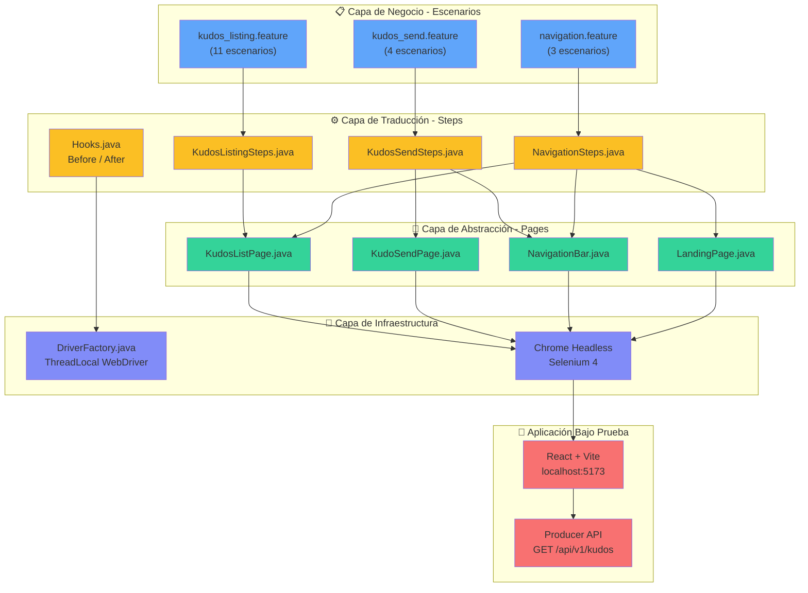

# 🧪 POM Page Factory — Sofkianos MVP E2E Automation

Framework de automatización E2E para el frontend de **Sofkianos MVP** usando **Page Object Model (POM)** con **Page Factory**, **Cucumber** y **JUnit 5**.

> 🔗 **Aplicación bajo prueba:** Este framework automatiza el frontend del proyecto [**Sofkianos MVP**](https://github.com/ElyRiven/sofkianos-mvp), un sistema distribuido de reconocimientos (Kudos) entre compañeros construido con React + Vite (frontend) y Spring Boot (backend).

---

## 📋 Tabla de Contenido

- [Arquitectura E2E](#arquitectura-e2e)
- [Historias de Usuario Cubiertas](#historias-de-usuario-cubiertas)
- [Estructura del Proyecto](#estructura-del-proyecto)
- [Instrucciones de Ejecución](#instrucciones-de-ejecución)
- [Reportes](#reportes)
- [Buenas Prácticas](#buenas-prácticas)

---

## Arquitectura E2E

Arquitectura consolidada desde los escenarios Gherkin hasta la aplicación bajo prueba:



---

## Historias de Usuario Cubiertas

### US-012 — Integración Frontend–Backend para Listado de Kudos

| Aspecto | Detalle |
|---|---|
| **Feature file** | `kudos_listing.feature` |
| **Page Object** | `KudosListPage.java` |
| **Escenarios** | 11 |
| **Cobertura UI** | Tabla de kudos, filtros (categoría, texto, fechas), paginación, ordenamiento, estados vacío/error |

**Como** usuario de Sofkianos MVP  
**Quiero** explorar los reconocimientos otorgados en la organización  
**Para** descubrir el impacto de la cultura de reconocimiento  

#### Escenarios del Listado

| # | Escenario | Validación |
|---|---|---|
| 1 | Visualizar listado al acceder | Tabla con columnas De, Para, Categoría, Mensaje, Fecha |
| 2 | Filtrar por categoría | Solo kudos de la categoría seleccionada |
| 3 | Filtrar por texto de búsqueda | Kudos que contienen el texto buscado |
| 4 | Filtrar por rango de fechas | Kudos dentro del rango especificado |
| 5 | Validar fecha inicio > fecha fin | Mensaje de error de validación |
| 6 | Limpiar filtros | Lista completa sin restricciones |
| 7 | Cambiar dirección de orden | Indicador refleja "Más recientes" / "Más antiguos" |
| 8 | Navegar a siguiente página | Tabla actualizada + indicador de página |
| 9 | Botón anterior deshabilitado en pág. 1 | Botón no clickeable |
| 10 | Estado vacío sin resultados | Mensaje "No se encontraron kudos" |
| 11 | Estado de error en falla de carga | Mensaje "Error al cargar kudos" + botón reintentar |

### Envío de Kudos (derivado de US-004 + US-012)

| Aspecto | Detalle |
|---|---|
| **Feature file** | `kudos_send.feature` |
| **Page Object** | `KudoSendPage.java` |
| **Escenarios** | 4 (incluye Scenario Outline con 4 categorías) |
| **Cobertura UI** | Formulario, selects, avatar preview, slider de envío, errores del servidor |

### Navegación (cross-cutting)

| Aspecto | Detalle |
|---|---|
| **Feature file** | `navigation.feature` |
| **Page Object** | `NavigationBar.java`, `LandingPage.java` |
| **Escenarios** | 3 |
| **Cobertura UI** | Transiciones Landing ↔ Lista ↔ Envío |

---

## Estructura del Proyecto

```
AUTO_FRONT_POM_FACTORY/
├── build.gradle                                    ← Dependencias y config
├── settings.gradle
├── gradle/wrapper/gradle-wrapper.properties
│
├── src/main/java/com/sofka/automation/
│   ├── drivers/
│   │   └── DriverFactory.java                      ← ThreadLocal + Chrome headless
│   └── pages/
│       ├── NavigationBar.java                       ← @FindBy → Navbar.tsx
│       ├── LandingPage.java                         ← @FindBy → LandingPage.tsx
│       ├── KudosListPage.java                       ← @FindBy → KudosListPage.tsx
│       └── KudoSendPage.java                        ← @FindBy → KudoForm.tsx
│
└── src/test/
    ├── java/com/sofka/automation/
    │   ├── runners/
    │   │   └── RunCucumberTest.java                 ← JUnit 5 + Cucumber
    │   └── stepdefinitions/
    │       ├── Hooks.java                           ← @Before / @After
    │       ├── TestConstants.java                   ← BASE_URL
    │       ├── KudosListingSteps.java               ← 11 escenarios US-012
    │       ├── KudosSendSteps.java                  ← 4 escenarios envío
    │       └── NavigationSteps.java                 ← 3 escenarios navegación
    └── resources/features/
        ├── kudos_listing.feature                    ← Declarativo — US-012
        ├── kudos_send.feature                       ← Declarativo — Envío
        └── navigation.feature                       ← Declarativo — Navegación
```

---

## Prerrequisitos

| Herramienta | Versión Mínima | Propósito |
|---|---|---|
| **Java JDK** | 17+ | Compilación y ejecución |
| **Gradle** | 8.x (wrapper incluido) | Build tool |
| **Google Chrome** | 120+ | Navegador para tests |
| **Frontend Sofkianos** | N/A | La app debe estar corriendo en `localhost:5173` |

### Verificar prerrequisitos

```bash
java -version       # Debe ser 17+
gradle --version    # Opcional si se usa wrapper
google-chrome --version  # Chrome instalado
```

---

## Instrucciones de Ejecución

### 1. Clonar el repositorio

```bash
git clone https://github.com/majoymajo/AUTO_FRONT_POM_FACTORY.git
cd AUTO_FRONT_POM_FACTORY
```

### 2. Asegurar que el frontend esté corriendo

El framework apunta a `http://localhost:5173`. El frontend de Sofkianos MVP debe estar disponible:

```bash
# Opción A: Con Docker (recomendado)
git clone https://github.com/ElyRiven/sofkianos-mvp.git
cd sofkianos-mvp
docker-compose -f docker-compose.dev.yml up -d

# Opción B: Desarrollo local
git clone https://github.com/ElyRiven/sofkianos-mvp.git
cd sofkianos-mvp/frontend
npm install
npm run dev
```

### 3. Ejecutar todos los tests

```bash
# Linux / macOS
./gradlew test

# Windows
gradlew.bat test
```

### 4. Ejecutar un feature específico

```bash
# Solo escenarios de listado (US-012)
./gradlew test -Dcucumber.features="src/test/resources/features/kudos_listing.feature"

# Solo escenarios de envío
./gradlew test -Dcucumber.features="src/test/resources/features/kudos_send.feature"

# Solo escenarios de navegación
./gradlew test -Dcucumber.features="src/test/resources/features/navigation.feature"
```

### 5. Ejecutar por tags (si se agregan)

```bash
./gradlew test -Dcucumber.filter.tags="@smoke"
```

---

## Reportes

Tras la ejecución, los reportes se generan en:

| Reporte | Ruta | Formato |
|---|---|---|
| **Cucumber HTML** | `build/reports/cucumber-report.html` | Visual con detalle por escenario |
| **JUnit XML** | `build/test-results/test/` | Para integración con CI/CD |
| **Consola** | Terminal | Pretty-print de pasos |

Para abrir el reporte HTML:

```bash
# Linux / macOS
open build/reports/cucumber-report.html

# Windows
start build/reports/cucumber-report.html
```

---

## Buenas Prácticas

### Page Object Model + Page Factory

| Práctica | Aplicación en este proyecto |
|---|---|
| **Responsabilidad única por página** | Cada page object encapsula una sola pantalla: `KudosListPage` solo conoce la lista, `KudoSendPage` solo conoce el formulario |
| **`@FindBy` declarativo** | Los localizadores se declaran como metadatos del campo, no dispersos en el código con `driver.findElement()` |
| **`PageFactory.initElements()`** | Inicialización lazy de elementos — se resuelven al interactuar, reduciendo errores de stale element |
| **Métodos retornan Page Objects** | `NavigationBar.navigateToExploreKudos()` retorna `KudosListPage` — la navegación es type-safe y el compilador valida transiciones |
| **Campos privados** | Los `WebElement` son detalles internos — solo se expone comportamiento mediante métodos públicos semánticos |
| **Métodos compuestos** | `KudoSendPage.fillKudoForm()` agrupa 4 acciones individuales para mantener los step definitions limpios |

### Gherkin Declarativo

| Principio | Ejemplo en este proyecto |
|---|---|
| **Lenguaje de negocio** | `"filtra los kudos por la categoría Teamwork"` en vez de `"hace click en el select y elige TEAMWORK"` |
| **Sin selectores CSS/XPath** | Los escenarios no mencionan IDs, clases, ni localizadores |
| **Estable ante rediseños** | Si el frontend cambia de tabla a cards, solo se modifican los Page Objects — los features no cambian |
| **Scenario Outline para datos** | Las 4 categorías (Innovation, Teamwork, Passion, Mastery) se validan con un solo escenario parametrizado |
| **Español para stakeholders** | Los escenarios están en español para ser legibles por POs, BAs y el equipo de QA |

### Código Limpio en Automatización

| Regla | Implementación |
|---|---|
| **Sin código comentado** | Ninguna clase contiene `//` comentarios inline ni bloques `/* */` deshabilitados |
| **Sin comentarios innecesarios** | Los nombres de métodos son auto-explicativos: `isEmptyStateDisplayed()`, `getDateValidationErrorText()` |
| **Naming semántico** | Métodos en inglés orientados al negocio, no a la implementación: `enterEmail()` vs `type1()` |
| **Constantes centralizadas** | `TestConstants.BASE_URL` en un solo lugar — no hardcoded en cada step |
| **Driver thread-safe** | `ThreadLocal<WebDriver>` permite ejecución paralela sin estado compartido |
| **Hooks para lifecycle** | `@Before`/`@After` garantizan un navegador limpio por escenario — sin ventanas huérfanas |

### Anti-patrón vs. Patrón Correcto

```
❌ IMPERATIVO (anti-patrón):
  Given el usuario abre el navegador
  And navega a "http://localhost:5173/kudos/list"
  And hace click en el select con aria-label "Filtrar por categoría"
  And selecciona la opción "Teamwork"
  And hace click en el botón "Aplicar Filtros"
  Then la tercera columna de cada fila contiene "Teamwork"

✅ DECLARATIVO (este proyecto):
  Given el usuario se encuentra en la página de exploración de kudos
  When filtra los kudos por la categoría "Teamwork"
  Then todos los kudos visibles pertenecen a la categoría "Teamwork"
```

---

## Stack Tecnológico

| Tecnología | Versión | Propósito |
|---|---|---|
| Java | 17 | Lenguaje base |
| Selenium WebDriver | 4.18.1 | Automatización del navegador |
| WebDriverManager | 5.7.0 | Gestión automática de drivers |
| Cucumber | 7.15.0 | Motor BDD + Gherkin |
| JUnit 5 | 5.10.2 | Runner de tests |
| AssertJ | 3.25.3 | Assertions fluidas |
| Gradle | 8.6 | Build tool |

---

## Aplicación Bajo Prueba

Este framework automatiza el frontend del proyecto **Sofkianos MVP**:

| Aspecto | Detalle |
|---|---|
| **Repositorio** | [github.com/ElyRiven/sofkianos-mvp](https://github.com/ElyRiven/sofkianos-mvp) |
| **Frontend** | React 18 + Vite + Tailwind CSS, servido con Nginx en puerto 5173 |
| **Backend** | Spring Boot (Producer API + Consumer Worker) con RabbitMQ y PostgreSQL |
| **Arquitectura** | Clean Architecture (Hexagonal) con microservicios |
| **Funcionalidad automatizada** | Listado público de Kudos con filtros, paginación y envío de reconocimientos |

---

## Licencia

Este proyecto es parte del proceso de formación en QA Automation de Sofka Technologies.
