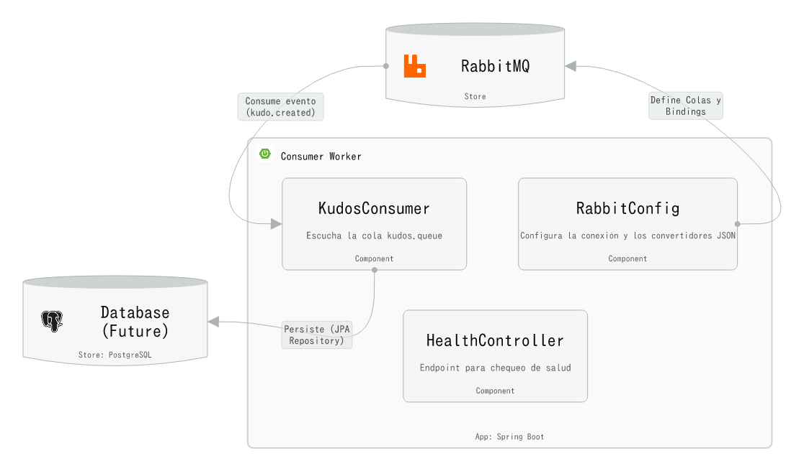

# Consumer Worker Service

## Overview

The Consumer Worker Service is a Spring Boot microservice responsible for asynchronous processing of gamification events in the SofkianOS system. It acts as a worker that listens to RabbitMQ messages from the `kudos.queue` and processes them to handle gamification logic, enabling decoupled and scalable event-driven architecture.

## Architecture (Level 3)



The service is composed of three main internal components:

- **RabbitConfig**: Configuration class that declares and binds the RabbitMQ infrastructure (queue, topic exchange, and routing key). It sets up the `kudos.queue`, `kudos.exchange`, and `kudos.key` binding required for message consumption.

- **KudosConsumer**: Event-driven consumer component that listens to the `kudos.queue` using Spring AMQP's `@RabbitListener` annotation. It processes incoming kudos messages asynchronously, implementing the listener pattern for handling gamification events.

- **HealthController**: REST controller that provides observability endpoints for health checks. It exposes a `GET /api/v1/health` endpoint that returns the service status, enabling container orchestration systems to monitor the service's availability.

## Tech Stack

- **Java 17**: Programming language
- **Spring Boot 3.3.5**: Application framework
- **Spring AMQP**: RabbitMQ integration
- **RabbitMQ**: Message broker for asynchronous communication
- **Docker**: Containerization
- **Maven**: Build tool

## Prerequisites

Before running the Consumer Worker Service, ensure the following:

- **RabbitMQ** must be running and accessible. The service expects RabbitMQ to be available at `localhost:5672` by default (configurable via `application.properties`).
- **Java 17** (if running without Docker)
- **Maven** (if building from source without Docker)

## How to Run

### Option A: Docker

1. **Build the Docker image:**
   ```bash
   docker build -t consumer-worker:latest .
   ```

2. **Run the container with host network:**
   ```bash
   docker run --network host consumer-worker:latest
   ```

   The service will start on port `8081` and connect to RabbitMQ on `localhost:5672`.

### Option B: Maven Wrapper

1. **Build the application:**
   ```bash
   ./mvnw clean package
   ```

2. **Run the JAR:**
   ```bash
   java -jar target/consumer-worker-1.0.0-SNAPSHOT.jar
   ```

   Alternatively, you can use Spring Boot's Maven plugin:
   ```bash
   ./mvnw spring-boot:run
   ```

The service will start on port `8081` (as configured in `application.properties`).

## Verification

### Health Check

Verify that the service is running correctly by checking the health endpoint:

```bash
curl http://localhost:8081/api/v1/health
```

Expected response:
```
Consumer Worker is running correctly!
```

### Viewing Consumed Messages

To verify that the service is consuming messages from RabbitMQ, check the application logs. The `KudosConsumer` component logs each received and processed message:

- **Received messages**: Look for log entries like `Received Kudo: [message content]`
- **Processed messages**: Look for log entries like `Kudo Processed!`

You can view logs by:

- **Docker**: `docker logs <container-id>` or `docker logs -f <container-id>` for follow mode
- **Maven**: Logs will appear in the console where you ran the application

### Swagger UI

The service includes Swagger UI for API documentation. Access it at:

```
http://localhost:8081/swagger-ui.html
```
