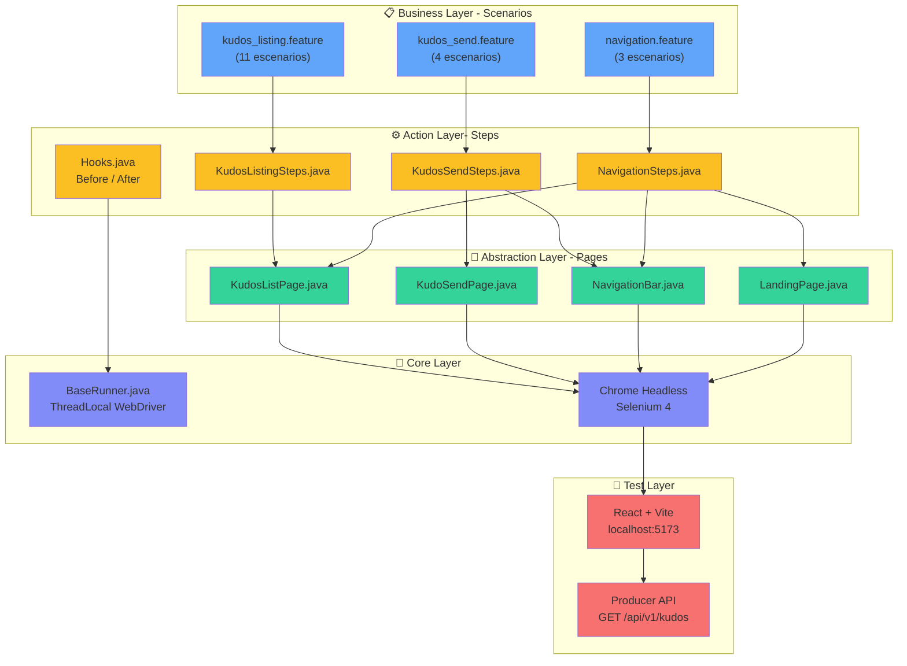

# 🧪 POM Page Factory — Sofkianos MVP E2E Automation

Framework de automatización E2E para el frontend de **Sofkianos MVP** usando **Page Object Model (POM)** con **Page Factory**, **Cucumber** y **JUnit 5**.

> 🔗 **Aplicación bajo prueba:** Este framework automatiza el frontend del proyecto [**Sofkianos MVP**](https://github.com/ElyRiven/sofkianos-mvp), un sistema distribuido de reconocimientos (Kudos) entre compañeros construido con React + Vite (frontend) y Spring Boot (backend).

---

## 📋 Tabla de Contenido

- [Arquitectura E2E](#arquitectura-e2e)
- [Historias de Usuario Cubiertas](#historias-de-usuario-cubiertas)
- [Estructura del Proyecto](#estructura-del-proyecto)
- [Instrucciones de Ejecución](#instrucciones-de-ejecución)
- [Reportes](#reportes)
- [Patrones de Diseño](#patrones-de-diseño)
- [Buenas Prácticas](#buenas-prácticas)

---

## Arquitectura E2E

Arquitectura consolidada desde los escenarios Gherkin hasta la aplicación bajo prueba:



---

## Historias de Usuario Cubiertas

### US-012 — Integración Frontend–Backend para Listado de Kudos

| Aspecto | Detalle |
|---|---|
| **Feature file** | `kudos_listing.feature` |
| **Page Object** | `KudosListPage.java` |
| **Escenarios** | 11 |
| **Cobertura UI** | Tabla de kudos, filtros (categoría, texto, fechas), paginación, ordenamiento, estados vacío/error |

**Como** usuario de Sofkianos MVP  
**Quiero** explorar los reconocimientos otorgados en la organización  
**Para** descubrir el impacto de la cultura de reconocimiento  

#### Escenarios del Listado

| # | Escenario | Validación |
|---|---|---|
| 1 | Visualizar listado al acceder | Tabla con columnas De, Para, Categoría, Mensaje, Fecha |
| 2 | Filtrar por categoría | Solo kudos de la categoría seleccionada |
| 3 | Filtrar por texto de búsqueda | Kudos que contienen el texto buscado |
| 4 | Filtrar por rango de fechas | Kudos dentro del rango especificado |
| 5 | Validar fecha inicio > fecha fin | Mensaje de error de validación |
| 6 | Limpiar filtros | Lista completa sin restricciones |
| 7 | Cambiar dirección de orden | Indicador refleja "Más recientes" / "Más antiguos" |
| 8 | Navegar a siguiente página | Tabla actualizada + indicador de página |
| 9 | Botón anterior deshabilitado en pág. 1 | Botón no clickeable |
| 10 | Estado vacío sin resultados | Mensaje "No se encontraron kudos" |
| 11 | Estado de error en falla de carga | Mensaje "Error al cargar kudos" + botón reintentar |

### Envío de Kudos (derivado de US-004 + US-012)

| Aspecto | Detalle |
|---|---|
| **Feature file** | `kudos_send.feature` |
| **Page Object** | `KudoSendPage.java` |
| **Escenarios** | 4 (incluye Scenario Outline con 4 categorías) |
| **Cobertura UI** | Formulario, selects, avatar preview, slider de envío, errores del servidor |

### Navegación (cross-cutting)

| Aspecto | Detalle |
|---|---|
| **Feature file** | `navigation.feature` |
| **Page Object** | `NavigationBar.java`, `LandingPage.java` |
| **Escenarios** | 3 |
| **Cobertura UI** | Transiciones Landing ↔ Lista ↔ Envío |

---

## Estructura del Proyecto

```
AUTO_FRONT_POM_FACTORY/
├── build.gradle                                    ← Dependencias y config
├── settings.gradle
├── gradle/wrapper/gradle-wrapper.properties
│
├── src/main/java/com/sofka/automation/
│   ├── runners/
│   │   ├── BaseRunner.java                         ← ThreadLocal + Browser lifecycle
│   │   ├── RunKudosListingTest.java                ← Runner por feature (listing)
│   │   ├── RunKudosSendTest.java                   ← Runner por feature (send)
│   │   └── RunNavigationTest.java                  ← Runner por feature (navigation)
│   └── pages/
│       ├── NavigationBar.java                       ← @FindBy → Navbar.tsx
│       ├── LandingPage.java                         ← @FindBy → LandingPage.tsx
│       ├── KudosListPage.java                       ← @FindBy → KudosListPage.tsx
│       └── KudoSendPage.java                        ← @FindBy → KudoForm.tsx
│
└── src/test/
    ├── java/com/sofka/automation/
    │   └── stepdefinitions/
    │       ├── Hooks.java                           ← @Before / @After
    │       ├── TestConstants.java                   ← BASE_URL
    │       ├── KudosListingSteps.java               ← 11 escenarios US-012
    │       ├── KudosSendSteps.java                  ← 4 escenarios envío
    │       └── NavigationSteps.java                 ← 3 escenarios navegación
    └── resources/features/
        ├── kudos_listing.feature                    ← Declarativo — US-012
        ├── kudos_send.feature                       ← Declarativo — Envío
        └── navigation.feature                       ← Declarativo — Navegación
```

---

## Prerrequisitos

| Herramienta | Versión Mínima | Propósito |
|---|---|---|
| **Java JDK** | 17+ | Compilación y ejecución |
| **Gradle** | 8.x (wrapper incluido) | Build tool |
| **Google Chrome** | 120+ | Navegador para tests |
| **Frontend Sofkianos** | N/A | La app debe estar corriendo en `localhost:5173` |

### Verificar prerrequisitos

```bash
java -version       # Debe ser 17+
gradle --version    # Opcional si se usa wrapper
google-chrome --version  # Chrome instalado
```

---

## Instrucciones de Ejecución

### 1. Ubicarse en el proyecto de automatización

Si estás trabajando dentro del monorepo `sofkianos-mvp`, el framework E2E vive en la carpeta `pom-pagefactory`:

```bash
# Desde la raíz del monorepo
cd pom-pagefactory
```

Si trabajas este proyecto de forma aislada, clónalo y entra a la carpeta raíz:

```bash
git clone https://github.com/majoymajo/AUTO_FRONT_POM_FACTORY.git
cd AUTO_FRONT_POM_FACTORY
```

### 2. Asegurar que el frontend esté corriendo

El framework apunta a `http://localhost:5173`. El frontend de Sofkianos MVP debe estar disponible:

```bash
# Desde la raíz del monorepo sofkianos-mvp
cd frontend
npm install
npm run dev
```

Si el frontend no está disponible en `localhost:5173`, los tests E2E fallarán con errores de Selenium como `TimeoutException` o `NoSuchElementException`.

### 3. Ejecutar todos los tests

```bash
# Linux / macOS
./gradlew test

# Windows PowerShell / CMD
.\gradlew.bat test
```

### 4. Ejecutar un feature específico

```bash
# Linux / macOS
./gradlew test -Dcucumber.features="src/test/resources/features/kudos_listing.feature"
./gradlew test -Dcucumber.features="src/test/resources/features/kudos_send.feature"
./gradlew test -Dcucumber.features="src/test/resources/features/navigation.feature"

# Windows PowerShell / CMD
.\gradlew.bat test -Dcucumber.features="src/test/resources/features/kudos_listing.feature"
.\gradlew.bat test -Dcucumber.features="src/test/resources/features/kudos_send.feature"
.\gradlew.bat test -Dcucumber.features="src/test/resources/features/navigation.feature"
```

Atajos por feature:

```bash
# Solo escenarios de listado (US-012)
.\gradlew.bat test -Dcucumber.features="src/test/resources/features/kudos_listing.feature"

# Solo escenarios de envío
.\gradlew.bat test -Dcucumber.features="src/test/resources/features/kudos_send.feature"

# Solo escenarios de navegación
.\gradlew.bat test -Dcucumber.features="src/test/resources/features/navigation.feature"
```

### 5. Ejecutar por tags (si se agregan)

```bash
# Linux / macOS
./gradlew test -Dcucumber.filter.tags="@smoke"

# Windows PowerShell / CMD
.\gradlew.bat test -Dcucumber.filter.tags="@smoke"
```

### 6. Ejecutar con Serenity Report

Esta es la forma recomendada y genera reportes automáticamente:

```bash
# Linux / macOS
./gradlew clean test aggregate

# Windows PowerShell / CMD
.\gradlew.bat clean test aggregate
```

El comando `aggregate` ejecuta Serenity Report con las siguientes características:
- Recolecta resultados de test en `build/test-results/test/`
- Genera reporte HTML en `target/site/serenity/`
- Procesa screenshots automáticamente
- Genera timeline de ejecución

### 7. Ejecutar tests por categoría con Serenity

```bash
# Solo listado de kudos
.\gradlew.bat clean test -Dcucumber.features="src/test/resources/features/kudos_listing.feature" aggregate

# Solo envío de kudos
.\gradlew.bat clean test -Dcucumber.features="src/test/resources/features/kudos_send.feature" aggregate

# Solo navegación
.\gradlew.bat clean test -Dcucumber.features="src/test/resources/features/navigation.feature" aggregate
```

### 8. Ejecutar con Tags y Serenity

```bash
# Ejecutar solo tests con @smoke
.\gradlew.bat clean test -Dcucumber.filter.tags="@smoke" aggregate

# Ejecutar excluyendo tests @skip
.\gradlew.bat clean test -Dcucumber.filter.tags="not @skip" aggregate
```

### 9. Flujo recomendado de ejecución (Serenity + Frontend)

```bash
# Terminal 1 - frontend
cd frontend
npm install
npm run dev

# Terminal 2 - E2E + Serenity
cd pom-pagefactory
.\gradlew.bat clean test aggregate

# Abrir reporte
Start-Process .\target\site\serenity\index.html
```

### 10. Quick Commands Reference

| Objetivo | Comando |
|---|---|
| **Ejecutar todo con Serenity** | `.\gradlew.bat clean test aggregate` |
| **Solo tests (sin reporte)** | `.\gradlew.bat test` |
| **Solo generar reporte de última ejecución** | `.\gradlew.bat aggregate` |
| **Limpiar y empezar de cero** | `.\gradlew.bat clean` |
| **Ver reportes recientes** | `Start-Process .\target\site\serenity\index.html` |

---

## Reportes

Tras la ejecución de tests, se generan múltiples reportes en diferentes formatos:

### Reportes Disponibles

| Reporte | Ruta | Formato | Descripción |
|---|---|---|---|
| **Serenity HTML** | `target/site/serenity/index.html` | HTML Visual | Reporte interactivo con detalles de escenarios, pasos ejecutados, screenshots y timeline |
| **Cucumber HTML** | `build/reports/cucumber.html` | HTML Pretty | Desglose por feature con estados pass/fail |
| **JUnit XML** | `build/test-results/test/` | XML | Para integración con CI/CD y dashboards |
| **Consola** | Terminal | Pretty-print | Resumen en tiempo real durante ejecución |

### Abrir Reportes Localmente

#### Serenity Report (Recomendado)

```bash
# Linux / macOS
open target/site/serenity/index.html

# Windows PowerShell
Start-Process .\target\site\serenity\index.html

# Windows CMD
start target\site\serenity\index.html
```

#### Cucumber Report

```bash
# Linux / macOS
open build/reports/cucumber.html

# Windows
start build/reports/cucumber.html
```

### Contenido del Reporte Serenity

El reporte Serenity incluye:
- ✅ **Resumen ejecutivo** — Estadísticas generales de pruebas (total, pasadas, fallidas)
- 📊 **Gráficos** — Distribución de resultados, timeline de ejecución
- 🎭 **Timeline por feature** — Árbol expandible con escenarios y pasos
- 📸 **Screenshots** — Capturados en cada paso (especialmente en fallos)
- ⏱️ **Duración** — Tiempo de cada escenario y paso individual
- 🏷️ **Trazabilidad** — Enlace directo al source code de features y steps
- 📋 **Evidencia** — Logs de navegador, eventos de Selenium, estados de elementos

---

## 3. Patrones de Diseño Utilizados

### Page Object Model (POM)
Es el pilar de la arquitectura. Permite crear un repositorio de objetos que representan las páginas del sitio, permitiendo que las pruebas sean legibles y fáciles de mantener al separar la lógica de la prueba de la lógica de la página.

### Page Factory
*   **Uso:** Implementado mediante las anotaciones `@FindBy` y el método `PageFactory.initElements(driver, this)` en los constructores de las páginas.
*   **Ventaja:** Proporciona una inicialización Lazy (perezosa). Los elementos no se buscan en el DOM hasta que son utilizados por primera vez, optimizando el rendimiento y evitando errores de `NoSuchElementException` prematuros.

### Factory Method (en NavigationBar.java)
*   **Uso:** Los métodos `navigateToExploreKudos()`, `navigateToSendKudos()` y `navigateToHome()` actúan como fábricas de objetos.
*   **Ventaja:** Al navegar, el método retorna automáticamente la instancia del Page Object de la página destino. Esto permite un estilo de programación fluido (Fluent Interface), donde el Step Definition sabe exactamente qué página está disponible después de una acción.

### Singleton / ThreadLocal Driver
*   **Uso:** En `BaseRunner.java`, se utiliza `ThreadLocal<WebDriver>`.
*   **Ventaja:** Garantiza la seguridad de hilos (Thread-Safety). Cada hilo de ejecución (importante para ejecución en paralelo con JUnit 5) tiene su propia instancia aislada del WebDriver. Además, centraliza el ciclo de vida (creación y cierre) del navegador en un solo punto estratégico.

---

## Buenas Prácticas Adicionales

### Gherkin Declarativo

| Principio | Ejemplo en este proyecto |
|---|---|
| **Lenguaje de negocio** | `"filtra los kudos por la categoría Teamwork"` en vez de `"hace click en el select y elige TEAMWORK"` |
| **Sin selectores CSS/XPath** | Los escenarios no mencionan IDs, clases, ni localizadores |
| **Estable ante rediseños** | Si el frontend cambia de tabla a cards, solo se modifican los Page Objects — los features no cambian |
| **Scenario Outline para datos** | Las 4 categorías (Innovation, Teamwork, Passion, Mastery) se validan con un solo escenario parametrizado |
| **Español para stakeholders** | Los escenarios están en español para ser legibles por POs, BAs y el equipo de QA |

### Código Limpio en Automatización

| Regla | Implementación |
|---|---|
| **Sin código comentado** | Ninguna clase contiene `//` comentarios inline ni bloques `/* */` deshabilitados |
| **Sin comentarios innecesarios** | Los nombres de métodos son auto-explicativos: `isEmptyStateDisplayed()`, `getDateValidationErrorText()` |
| **Naming semántico** | Métodos en inglés orientados al negocio, no a la implementación: `enterEmail()` vs `type1()` |
| **Constantes centralizadas** | `TestConstants.BASE_URL` en un solo lugar — no hardcoded en cada step |
| **Hooks para lifecycle** | `@Before`/`@After` garantizan un navegador limpio por escenario — sin ventanas huérfanas |


---

## Stack Tecnológico

| Tecnología | Versión | Propósito |
|---|---|---|
| Java | 17 | Lenguaje base |
| Selenium WebDriver | 4.18.1 | Automatización del navegador |
| WebDriverManager | 5.7.0 | Gestión automática de drivers |
| Cucumber | 7.15.0 | Motor BDD + Gherkin |
| JUnit 5 | 5.10.2 | Runner de tests |
| AssertJ | 3.25.3 | Assertions fluidas |
| Gradle | 8.6 | Build tool |

---

## Aplicación Bajo Prueba

Este framework automatiza el frontend del proyecto **Sofkianos MVP**:

| Aspecto | Detalle |
|---|---|
| **Repositorio** | [github.com/ElyRiven/sofkianos-mvp](https://github.com/ElyRiven/sofkianos-mvp) |
| **Frontend** | React 18 + Vite + Tailwind CSS, servido con Nginx en puerto 5173 |
| **Backend** | Spring Boot (Producer API + Consumer Worker) con RabbitMQ y PostgreSQL |
| **Arquitectura** | Clean Architecture (Hexagonal) con microservicios |
| **Funcionalidad automatizada** | Listado público de Kudos con filtros, paginación y envío de reconocimientos |

---

## Licencia

Este proyecto es parte del proceso de formación en QA Automation de Sofka Technologies.
